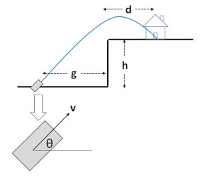

# Lab 5: Project #5

## CUDA: Monte Carlo Simulation

### 100 Points

## Notes

- `flip` does not have GPU cards, so CUDA and OpenCL will compile there but will not run there.
- You can run this on `rabbit`, on the DGX machine, or on your own NVIDIA GPU system.
- CUDA is NVIDIA-only. It will not run on Intel or AMD GPUs.
- This is a pivot-table project because the benchmarks vary along both `NUMTRIALS` and `BLOCKSIZE`.

## Introduction

Monte Carlo simulation is used to determine the range of outcomes for a set of parameters that each vary according to a probability distribution. In this project, you will take a projectile scenario, implement a CUDA-based Monte Carlo simulation for it, and determine how likely a successful hit is.

## The Scenario

A castle sits on top of a cliff. An amateur band of mercenaries is trying to destroy it with a cannon. The geometry would normally be straightforward, but these attackers are poor at estimating distances and poor at aiming, so all five inputs vary within fixed ranges. Your job is to determine the probability that the cannonball actually hits the castle.



## Requirements

1. Use these parameter ranges:

| Variable | Meaning | Range |
| --- | --- | --- |
| `g` | Ground distance to the cliff face | `20.` to `30.` |
| `h` | Height of the cliff face | `10.` to `20.` |
| `d` | Upper deck distance to the castle | `10.` to `20.` |
| `v` | Cannonball initial velocity | `10.` to `30.` |
| `theta` | Cannon firing angle in degrees | `70.` to `80.` |

2. These values are different from Project 1, so the final probability will also be different.
3. Run at least these `BLOCKSIZE` values: `8`, `32`, `64`, `128`, and `256`.
4. Combine those with at least these `NUMTRIALS` values: `1024`, `4096`, `16384`, `65536`, `262144`, `1048576`, and `2097152`.
5. Make sure every `NUMTRIALS` value is a multiple of `1024`.
6. Record timing for every combination and report performance in units such as MegaTrials/Second.
7. Use CUDA timing, not OpenMP timing. The starter code already does this.
8. Produce a rectangular table and two graphs:
   - Performance vs. `NUMTRIALS` with multiple colored curves of `BLOCKSIZE`
   - Performance vs. `BLOCKSIZE` with multiple colored curves of `NUMTRIALS`
9. As in Project 1, fill the random-value arrays ahead of time and copy them to the GPU as look-up tables.
10. Pick one benchmark run and state what you think the actual probability is.
11. Do not compute Parallel Fraction or Maximum Speedup for this project.

## Equations

Use the same projectile equations as Project 1.

## Starter Files

- Skeleton CUDA file: [proj05.cu](https://github.com/Picomp-lab/CS-4-575-Introduction-to-Parallel-Computing/blob/main/lab5/proj05.cu)
- Helper header: [exception.h](https://github.com/Picomp-lab/CS-4-575-Introduction-to-Parallel-Computing/blob/main/lab5/exception.h)
- Helper header: [helper_functions.h](https://github.com/Picomp-lab/CS-4-575-Introduction-to-Parallel-Computing/blob/main/lab5/helper_functions.h)
- Helper header: [helper_cuda.h](https://github.com/Picomp-lab/CS-4-575-Introduction-to-Parallel-Computing/blob/main/lab5/helper_cuda.h)
- Helper header: [helper_image.h](https://github.com/Picomp-lab/CS-4-575-Introduction-to-Parallel-Computing/blob/main/lab5/helper_image.h)
- Helper header: [helper_string.h](https://github.com/Picomp-lab/CS-4-575-Introduction-to-Parallel-Computing/blob/main/lab5/helper_string.h)
- Helper header: [helper_timer.h](https://github.com/Picomp-lab/CS-4-575-Introduction-to-Parallel-Computing/blob/main/lab5/helper_timer.h)
## Linux Workflow

On `rabbit`, the project page gives this working script:

```bash
#!/bin/bash
for t in 1024 4096 16384 65536 262144 1048576 2097152
do
        for b in 8 32 64 128 256
        do
                /usr/local/apps/cuda/cuda-10.1/bin/nvcc -DNUMTRIALS=$t -DBLOCKSIZE=$b -o proj05 proj05.cu
                ./proj05
        done
done
```

On the DGX system, the page gives this working `sbatch` script:

```bash
#!/bin/bash
#SBATCH  -J  MonteCarlo
#SBATCH  -A  cs475-575
#SBATCH  -p  classgputest
#SBATCH  --gres=gpu:1
#SBATCH  -o  montecarlo.out
#SBATCH  -e  montecarlo.err
#SBATCH  --mail-type=BEGIN,END,FAIL
#SBATCH  --mail-user=mjb@oregonstate.edu
for t in 2048 8192 131072 2097152
do
        for b in 8 16 32 64 128
        do
                /usr/local/apps/cuda/11.7/bin/nvcc -DNUMTRIALS=$t -DBLOCKSIZE=$b -o proj05 proj05.cu
                ./proj05
        done
done
```

You can and should script the benchmark combinations. Passing benchmark values with `-DNUMTRIALS=...` and `-DBLOCKSIZE=...` works with `nvcc`.

Before using the DGX, do preliminary development on `rabbit`, since it is easier to work with interactively. If you have time, take final benchmark numbers on the DGX, where performance should be much higher. You can also take your benchmark numbers on your own machine.

## Important Implementation Note

In Project 1, you could count hits with `numHits++`. In this CUDA version, there is no single shared GPU-side `numHits`. Instead, the kernel writes `0` or `1` into a device array for each trial, copies that array back to the CPU, and then the CPU sums the results.

## PDF Commentary

Your PDF should include:

1. The machine you ran on
2. What you think the new probability is
3. The rectangular table and both graphs
4. The patterns you see in the performance curves
5. Why you think the curves look that way
6. Why a `BLOCKSIZE` of `8` performs much worse than the others
7. How the results compare with Project 1 and why
8. What these results imply about GPU parallel computing

## Grading

| Feature | Points |
| --- | ---: |
| Correct probability | 10 |
| Performance table | 20 |
| Graph of performance vs. `NUMTRIALS` with multiple curves of `BLOCKSIZE` | 20 |
| Graph of performance vs. `BLOCKSIZE` with multiple curves of `NUMTRIALS` | 20 |
| Commentary explaining the trends of the curves | 30 |
| Potential Total | 100 |
