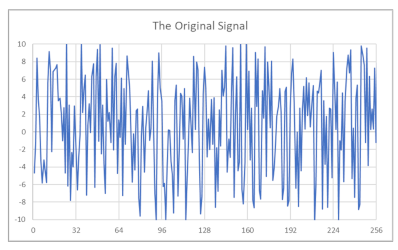

# Lab 6

## CS 475/575 -- Spring Quarter 2025

### Fourier Analysis using MPI

### 120 Points

---

## Notes

- This is a CPU cluster project.
- The `flip` machines are not a cluster, so MPI will not run there.
- You will need to use the `submit-*` machines.
- Because the only benchmark input here is `NumCpus` from the MPI command line, this is not a Pivot Table project.
- Check your `MPI_Send` and `MPI_Recv` calls carefully. The number of items received should match the number of items sent.

## Introduction

Fourier analysis helps determine whether a noisy-looking signal contains hidden periodic structure. In this project, you will examine a large signal, compute Fourier sums for many candidate periods, and look for the periods that stand out strongly enough to reveal embedded sine waves.

The provided signal looks random at first glance:



The core idea is to multiply each signal element by sine waves of different periods and then sum the products. If the signal is only noise, positive and negative contributions tend to cancel. If a hidden sine wave is present, the matching period produces a noticeably larger sum.

Scientists and engineers use this type of analysis to look for regular structure in data that otherwise appears random. Your job here is to implement the computation with MPI and compare performance across different processor counts.

## Requirements

1. Read one of the provided signal files:
   - [bigsignal.txt](./bigsignal.txt)
   - [bigsignal.bin](./bigsignal.bin)
2. Each file contains `1,048,576` signal amplitudes.
3. Confirm that your downloaded file is complete by checking the size:

| File | Size in bytes |
| --- | ---: |
| `bigsignal.bin` | `4194304` |
| `bigsignal.txt` | `9437184` |

4. A serial C/C++ version of the multiply-and-sum computation looks like this:

```cpp
BigSums[0] = 0.;
for( int p = 1; p < MAXPERIODS; p++ )
{
    BigSums[p] = 0.;
    float omega = F_2_PI / (float)p;
    for( int t = 0; t < NUMELEMENTS; t++ )
    {
        BigSums[p] += BigSignal[t] * sin( omega*(float)t );
    }
}
```

5. Implement this using MPI parallelism.
6. Each processor is responsible for Fourier-transforming `NUMELEMENTS / NumCpus` elements.
7. Create a scatterplot of the `MAXPERIODS` Fourier `Sums[*]` values versus period.
8. There are two secret sine waves in the signal. The scatterplot should show two clear spikes whose x-axis locations reveal the periods.
9. In your PDF report, state what you think the two secret sine-wave periods are.
10. Draw a graph showing performance versus the number of MPI processors used.
11. Pick appropriate performance units and make sure "faster" goes up.
12. Turn in to Canvas:
   - Your source code file (`.cpp`)
   - Your commentary in a PDF file

## Commentary PDF

Your PDF should include:

1. The `Sums[*]` vs. period scatterplot
2. The two secret sine-wave periods
3. Your graph of performance vs. number of processors used
4. The patterns you see in the performance graph
5. Why you think the performance behaves that way

## Skeleton Code

The provided starter file is [proj07.cpp](./proj07.cpp).

## Grading

| Feature | Points |
| --- | ---: |
| Fourier `Sums[*]` vs. period graph | 30 |
| Report the two correct sine-wave periods | 30 |
| Performance graph using at least `1`, `2`, `4`, `6`, `8` processors | 30 |
| Commentary in the PDF file | 30 |
| Potential Total | 120 |
